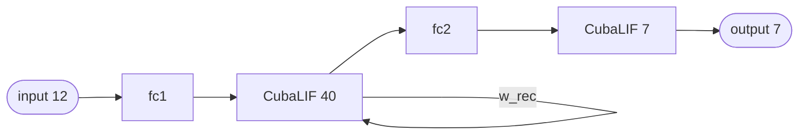

# BrailleNN (Norse) — a recurrent network



A **recurrent** spiking network for Braille-letter reading, exported from
**[Norse](https://github.com/norse/norse)**. It is one of the reference models from the
[NIR paper](https://neuroir.org/), obtained from the [Synfire](https://synfire.dev/) model
registry. Synfire ships the model graph only, so the `input.csv` used here is a **randomly
generated** spike train — enough to exercise the pipeline end to end, not a task-accuracy run.

It is the example that exercises snn-mlir's one supported cycle: the **canonical SNN
self-recurrence**, where a neuron's spikes feed a recurrent synapse that projects back onto the
same neuron (see [Recurrence](../python/nir-mapping.md#recurrence)).

## Network structure

```
input(12) → fc1 → CubaLIF(40) → fc2 → CubaLIF(7) → output(7)
                     ↑    ↓
                   w_rec ←┘         (the CubaLIF(40) layer recurs on itself)
```

Two `Linear` synapses feed the hidden `CubaLIF(40)` population, whose spikes are fed back one
timestep later through the recurrent synapse `w_rec`. The recurrent edge is broken at the
timestep boundary — `w_rec` reads the *previous* step's spikes from a dedicated state buffer,
which the generated `main.c` carries across calls.

## Files in the example

| File | Role |
|---|---|
| `model.nir` | The Norse-exported network in NIR — the input to `snn-mlir`. |
| `input.csv` | Randomly generated input spikes: 50 rows (timesteps) × 12 columns (channels). |
| `build/` | Generated artefacts. Created by `codegen`/`run`, not checked in. |

## Run it

```bash
uv run snn-mlir run examples/brailernn/1.0.1              # float32
uv run snn-mlir run examples/brailernn/1.0.1 --quantize   # int8 weights, Q12 state
```

The 50 rows of `input.csv` set `N_STEPS`; output lands in
`examples/brailernn/1.0.1/build/results.csv`, 7 columns wide. Without the toolchain,
`snn-mlir codegen examples/brailernn/1.0.1` stops after generating the sources.

The generated `build/` directory and the by-hand lower→compile→run steps are identical to the
[Oxford example](snn-oxford.md#the-long-way-by-hand) — just swap the paths.

!!! note "The recurrence is invisible from the CLI"
    Nothing extra is needed to run a recurrent model — the state buffer and its timestep copy are
    generated automatically. It is only the *graph* that must match the canonical self-recurrence
    shape; branching and other cycles are still rejected (see [Limitations](../limitations.md)).
