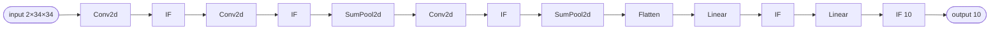

# N-MNIST CNN (Sinabs) — a convolutional network



A **convolutional** spiking network for the N-MNIST event dataset, exported from
**[Sinabs](https://sinabs.readthedocs.io/)**. It is one of the reference models from the
[NIR paper](https://neuroir.org/), obtained from the [Synfire](https://synfire.dev/) model
registry. Synfire ships the model graph only, so the `input.npy` used here is a **randomly
generated** event stream — enough to drive the pipeline end to end, not a task-accuracy run.

This is the example that exercises the convolutional and pooling ops: `snn.conv2d`,
`snn.sumpool2d`, and the non-leaky `IF` neuron (which maps to `snn.lif`).

## Network structure

```
input(2 × 34 × 34)
  → Conv2d → IF
  → Conv2d → IF → SumPool2d
  → Conv2d → IF → SumPool2d
  → Flatten
  → Linear → IF
  → Linear → IF(10)
```

The input is an N-MNIST frame: 2 polarity channels of 34×34 pixels. Three convolutional stages
(each followed by an `IF` neuron, two with sum pooling) feed a flattened classifier ending on a
10-way `IF` output.

## Files in the example

| File | Role |
|---|---|
| `model.nir` | The Sinabs-exported network in NIR — the input to `snn-mlir`. |
| `input.npy` | Randomly generated events: `[100, 2, 34, 34]` int8. Axis 0 is the timestep; the trailing `2×34×34 = 2312` values are flattened per frame (a notice is printed). |
| `build/` | Generated artefacts. Created by `codegen`/`run`, not checked in. |

!!! note "An `.npy` input, not a CSV"
    A conv frame is naturally multi-dimensional, so this example ships an `input.npy` rather than
    an `input.csv`. `snn-mlir` accepts either; a rank-3+ array is flattened to
    `[n_steps, features]` per timestep and reshaped back into the conv input inside the kernel.
    See [Bring your own model](../getting-started/quickstart.md#3-bring-your-own-model).

## Run it

```bash
uv run snn-mlir run examples/nmnistcnn/1.0.0              # float32
uv run snn-mlir run examples/nmnistcnn/1.0.0 --quantize   # int8 weights, Q12 state
```

The 100 frames of `input.npy` set `N_STEPS`; output lands in
`examples/nmnistcnn/1.0.0/build/results.csv`, 10 columns wide. Without the toolchain,
`snn-mlir codegen examples/nmnistcnn/1.0.0` stops after generating the sources.
