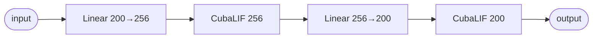

# SNN Oxford (LAVA-DL)



A complete, end-to-end example: a two-layer CubaLIF network trained with **LAVA-DL** on the
Oxford spike-train dataset, exported to NIR, and run through `snn-mlir` all the way to a
compiled binary.

> Reference model & training: LAVA-DL SLAYER Oxford tutorial —
> <https://lava-nc.org/lava-lib-dl/slayer/notebooks/oxford/train.html>

## Network structure

```
Linear(200 → 256) → CubaLIF(256) → Linear(256 → 200) → CubaLIF(200)
```

Exported as `examples/snn_oxford/network.nir`. Two `Affine`/`Linear` synapse layers feeding two
`CubaLIF` neuron populations, ending on a spike-output layer.

## Files in the example

| File | Role |
|---|---|
| `network.nir` | The trained network in NIR — the input to `snn-mlir`. |
| `input.csv` | Input spike trains: 100 rows (timesteps) × 200 columns (input channels). |
| `build/` | Generated artefacts — see below. Created by `codegen`/`run`, not checked in. |

That's the whole folder contract: exactly one `.nir` and an `input.csv`. The row count of the
CSV is what sets `N_STEPS`, so there is no timestep flag to pass.

## Run it

### The short way

```bash
uv run snn-mlir run examples/snn_oxford              # float32
uv run snn-mlir run examples/snn_oxford --quantize   # int8 weights, Q12 state
```

That generates the sources, compiles them, executes the binary, and writes
`examples/snn_oxford/build/results.csv` — one row of 200 output spikes per timestep. It needs
the full toolchain; without it, `snn-mlir codegen examples/snn_oxford` stops after generating
the sources.

Either way you get `examples/snn_oxford/build/`:

```
network.mlir   ← SNN dialect IR (weights baked in as constant globals)
snn_data.h     ← layer-size constants
input.h        ← input.csv baked into int8_t L0_input[100][200]
main.c         ← memref descriptors + timestep loop + CSV output
```

plus, from `run`, `network.ll`, `network.o`, the `snn_exe` binary, and `results.csv`.

### The long way, by hand

Useful when you want to inspect or modify a stage. `run` does exactly this:

```bash
uv run snn-mlir codegen examples/snn_oxford

export MLIR_DIR=/path/to/llvm-project/build/lib/cmake/mlir
bash pipelines/lower_cpu_linux.sh examples/snn_oxford/build/network.mlir
# → examples/snn_oxford/build/network.ll

# Compile the IR with the SAME LLVM that built snn-opt, then link with any C compiler.
$MLIR_DIR/../../../bin/llc --relocation-model=pic -filetype=obj \
    examples/snn_oxford/build/network.ll -o examples/snn_oxford/build/network.o

cc examples/snn_oxford/build/main.c examples/snn_oxford/build/network.o \
   -o examples/snn_oxford/build/sim -lm

./examples/snn_oxford/build/sim          # prints one CSV row per timestep
```

!!! warning "Don't hand `network.ll` to your system clang"
    The IR is emitted by whichever LLVM built `snn-opt`, and an older system clang will reject
    it outright. Always go `.ll` → `.o` with the matching `llc`, then let the system compiler
    see only plain C and an object file.

### Reading the output

The binary prints one CSV row per timestep between `CSV_START`/`CSV_END` markers; `run`
strips the markers and saves the rows as `results.csv`. No reference is shipped and no
comparison is made — diff it against your simulator's output however you prefer. Float mode
should track the simulator closely; `--quantize` will differ by the quantization error, which
is exactly the thing worth measuring before you deploy.
