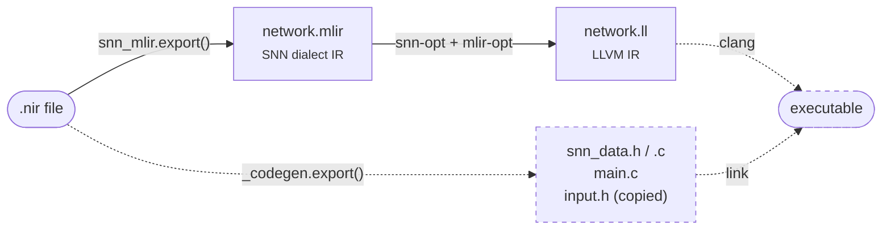

# How it works

snn-mlir turns a trained spiking network — expressed in the framework-neutral
[NIR](https://neuroir.org/) format — into a portable, hardware-ready intermediate
representation built on [MLIR](https://mlir.llvm.org/).

!!! note
    The repository itself covers the **Python** frontend and the **MLIR** dialect — the solid
    path, from a `.nir` file to `network.mlir` and on to `network.ll`. The **dotted** path (C
    runtime generation via `_codegen.export()`, `clang` compilation, and linking into an
    executable) is **not part of the package**. It is shown here, and provided only in the
    [examples](../examples/snn-oxford.md), to demonstrate one full end-to-end run.

## Two components

The project has two clearly separated halves:

- **A Python frontend (the `snn-mlir` package).** It reads a NIR graph and emits **SNN dialect
  MLIR text** — optionally quantized. This is the part neuromorphics engineers extend to cover
  more NIR nodes, more dimensions, or new framework integrations. See
  [Python API (NIR parser)](../python/nir-mapping.md).
- **An MLIR dialect + lowering (C++).** The `snn` dialect defines the spiking operations as
  first-class, transformable MLIR ops, and a reference lowering converts them to standard
  `linalg`/`arith`. This is the part compiler and hardware engineers extend to add new
  backends. See [SNN MLIR dialect](../dialect/overview.md).

## What it's for

The goal is to make spiking networks **portable to embedded systems** through a shared,
inspectable IR, and in doing so to:

- give **hardware developers** a clean place to plug in their own backends (CPU, FPGA, ASIC)
  under a common representation;
- give **neuromorphics engineers** a fast way to test embedded inference of a trained network
  without hand-writing C for every target;
- keep everything **open and standard**, so the same `network.mlir` can be optimized and
  retargeted with off-the-shelf MLIR passes.

## How we expect people to use (and grow) it

There are two directions of contribution, mirroring the two components:

- **From the NIR side** — broaden the frontend: more NIR node types, higher-dimensional
  activations, additional framework/loop integrations, richer quantization.
- **From the MLIR side** — broaden the backend: new open-source lowerings and hardware
  targets, performance metrics, additional optimization passes.

!!! note "Scope: this package produces the MLIR file"
    The `snn-mlir` Python package is responsible for the **`network.mlir`** output only.
    Generating the C runtime files, compiling them, and linking an executable is **outside**
    the package — that's deliberately your toolchain's job.

    To show the full picture, the [examples](../examples/snn-oxford.md) provide a complete,
    runnable flow — from a **LAVA-DL** and a **snnTorch** model all the way to a compiled
    binary — using the helper `examples/_codegen.py` to generate the C side.

## The pipeline, step by step

- `snn_mlir.export()` converts the NIR graph to SNN dialect MLIR text.
- `_codegen.export()` (in `examples/_codegen.py`, example-only) generates the C runtime files:
  memref descriptor typedefs, neuron-state buffers, and a `main.c` timestep loop. (Weights are
  baked into `network.mlir` as constant globals, so the C side no longer carries weight arrays.)
- `pipelines/lower_cpu_linux.sh` chains `snn-opt → mlir-opt → mlir-translate` to produce LLVM IR.
- A standard C compiler links everything into a self-contained binary.
