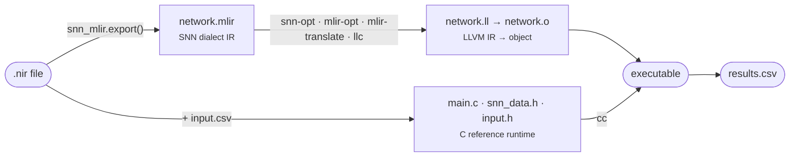

# How it works

snn-mlir turns a trained spiking network — expressed in the framework-neutral
[NIR](https://neuroir.org/) format — into a portable, hardware-ready intermediate
representation built on [MLIR](https://mlir.llvm.org/), and then into C you can compile and
run on a CPU.

Three of the CLI verbs are spans of that same path:

| Verb | Covers |
|---|---|
| `snn-mlir export` | `.nir` → `network.mlir` |
| `snn-mlir codegen` | `.nir` + `input.csv`/`.npy` → `build/` (MLIR **and** C sources) |
| `snn-mlir run` | everything, ending in `build/results.csv` |

The fourth, `snn-mlir check`, is not a span of the path but a look down it: it applies the
front-end's rules to every node without converting anything, and reports which of the
[limitations](../limitations.md) your particular model runs into.

## Two components

The project has two clearly separated halves:

- **A Python frontend (the `snn-mlir` package).** It reads a NIR graph and emits **SNN dialect
  MLIR text** — optionally quantized — plus the C sources of a reference runtime. See
  [Python API (NIR parser)](../python/nir-mapping.md).
- **An MLIR dialect + lowering (C++).** The `snn` dialect defines the spiking operations as
  first-class, transformable MLIR ops, and a reference lowering converts them to standard
  `linalg`/`arith`. This is where new hardware backends plug in. See
  [SNN MLIR dialect](../dialect/overview.md).

!!! note "What ships, and what stays yours"
    What ships is a complete **CPU reference**: NIR in, a running x86-64 binary out. What is
    deliberately yours is the **hardware backend** — your own lowering pass, your own runtime,
    your own board. The reference exists so you have a known-good baseline to check that
    backend against.

## What it's for

The goal is to make spiking networks **portable to embedded systems** through a shared,
inspectable IR, and in doing so to:

- give **hardware developers** a clean place to plug in their own backends (CPU, FPGA, ASIC)
  under a common representation;
- give **application engineers** a fast way to run a trained network on a real CPU without
  hand-writing C for every target;
- keep everything **open and standard**, so the same `network.mlir` can be optimized and
  retargeted with off-the-shelf MLIR passes.

## Three ways to use it

Which part of snn-mlir you touch depends on what you are building.

### 1. Compiler & hardware engineers — bring your own backend

You have an accelerator (FPGA, ASIC, a custom RISC-V extension) and you want SNN workloads on
it. You work at the **dialect** level: read `network.mlir`, understand the `snn` ops and the
two op interfaces, and write your own lowering pass alongside the reference `SNNToLinalg`. The
Python frontend is just your input generator.

Start at [Overview & operations](../dialect/overview.md), then
[Implementing a lowering pass](../dialect/lowering-pass.md). If you are embedding the dialect
in a larger compiler, see [Using the dialect in your project](embedding.md).

### 2. Application engineers — run SNNs on ordinary CPUs

You have a trained model and a board — a Raspberry Pi, a Cortex-M part, an Arduino — and you
want it running, fast, without writing C by hand. You work at the **CLI** level: point
`snn-mlir` at a folder holding your `.nir` and an `input.csv` and get compilable C out; on the
host, `run` compiles and executes it for you.

`run` targets the host CPU (Linux/x86-64 today). For another board, take the `codegen` output:
`network.mlir` lowers through your own LLVM target triple, and the generated `main.c` is a
template for your own runtime — the kernel it calls, `@snn_forward_step`, is a plain C ABI.

Start at [Quick start](quickstart.md), then the [examples](../examples/snn-oxford.md).

### 3. AI & neuromorphics engineers — widen the frontend

You train networks and want the compiler to understand them. You work at the **Python package**
level: `.nir` → `.mlir`, quantization, and adding coverage for the NIR nodes and topologies
your models actually use.

Start at [NIR mapping](../python/nir-mapping.md) and [Quantization](../python/quantization.md);
[Adding a NIR node type](../python/nir-node.md) is the concrete extension point, and
[Limitations](../limitations.md) lists what is still missing.

!!! tip "All three directions are open to contribution"
    New node types, new lowerings, new targets — see [Contributing](../contributing.md). If
    your simulator writes a NIR graph we don't handle yet, send it to us and we'll take a look.

## The pipeline, step by step

1. **NIR → MLIR.** `snn_mlir.export()` walks the NIR graph and emits SNN dialect MLIR text.
   Weights and biases are baked in as `memref.global "private" constant` values, so the module
   is self-contained.
2. **C runtime generation.** `codegen` adds `snn_data.h` (layer-size macros), `input.h` (your
   `input.csv` baked into an `int8_t L0_input[N_STEPS][INPUT_SIZE]` array), and `main.c` — the
   memref descriptors, the neuron-state buffers carried across timesteps, and the loop that
   prints one CSV row per step.
3. **MLIR → LLVM IR.** `snn-opt --convert-snn-to-linalg` lowers the `snn` ops to
   `linalg`/`arith`; stock `mlir-opt` passes take it down to the LLVM dialect; `mlir-translate
   --mlir-to-llvmir` emits `network.ll`. `pipelines/lower_cpu_linux.sh` drives exactly this by
   hand.
4. **Compile and link.** `llc` compiles `network.ll` to `network.o` — with the *same* LLVM that
   built `snn-opt`, so the IR version always matches — and a system C compiler builds `main.c`
   and links the two.
5. **Run.** The binary prints its per-timestep output, which `run` captures into
   `build/results.csv`.
