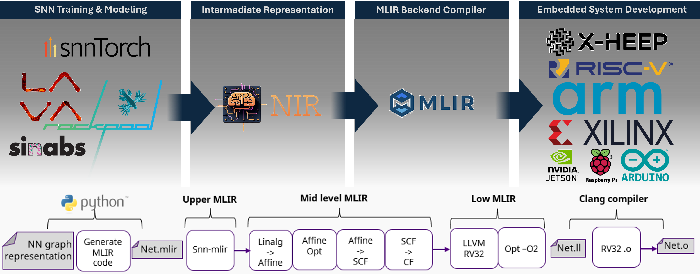

# SNN-MLIR

[](https://github.com/INTERA-GROUP/snn-mlir/actions/workflows/ci.yml)
[](https://snn-mlir.readthedocs.io/en/latest/)
[](https://pypi.org/project/snn-mlir/)
[](https://arxiv.org/abs/2606.09213)
[](https://open-neuromorphic.org/)

An out-of-tree [MLIR](https://mlir.llvm.org/) dialect for Spiking Neural Networks (SNNs),
compatible with the [NIR (Neuromorphic Intermediate Representation)](https://neuroir.org/) standard.

The dialect provides type-polymorphic operations that work with both `f32` (float) and
quantized (`i8`/`i32`) types, enabling a single IR to target both simulation and
hardware-optimized deployments. A reference CPU lowering (`SNNToLinalg`) converts SNN ops to
standard `linalg`/`arith` operations that any MLIR-based backend can consume.

A companion Python package (`snn-mlir`, available on [PyPI](https://pypi.org/project/snn-mlir/))
reads any NIR file and emits SNN dialect MLIR text, together with the C sources of a reference
CPU runtime. Its `snn-mlir` command takes a trained network from `.nir` to a running binary
without writing a line of Python:

```bash
snn-mlir export  model.nir      # → model.mlir          (SNN dialect IR)
snn-mlir codegen my_model/      # → my_model/build/     (MLIR + C sources)
snn-mlir run     my_model/      # → build/results.csv   (compiled and executed)
```

See the [Quick start](getting-started/quickstart.md).



---

## Supported simulators

NIR is supported as an export target by a growing list of SNN frameworks. Any of them can in
principle feed `snn-mlir`; the table below shows which we have **tested end-to-end through the
MLIR pipeline** and which ship as a runnable example.

| Framework | Exports to NIR | Tested through MLIR | Example |
|---|:---:|:---:|:---:|
| [LAVA / lava-dl](https://github.com/lava-nc/lava-dl) | ✅ | ✅ | [SNN Oxford](examples/snn-oxford.md) |
| [snnTorch](https://github.com/jeshraghian/snntorch/) | ✅ | ✅ | [SNNTorch](examples/snntorch.md) |
| [hxtorch (BrainScaleS-2)](https://github.com/electronicvisions/hxtorch) | ✅ | — | — |
| [Nengo](https://nengo.ai/) | ✅ | — | — |
| [Norse](https://github.com/norse/norse) | ✅ | — | — |
| [Rockpool](https://rockpool.ai/) | ✅ | — | — |
| [Sinabs](https://sinabs.readthedocs.io/) | ✅ | — | — |

!!! note "Does your simulator export to NIR but isn't tested here?"
    We'd love to extend coverage. If your framework writes a NIR graph that `snn-mlir` doesn't
    yet handle, you are very welcome to **send us the NIR graph** and we'll test it and add
    support. See [Contributing](contributing.md).

---

## Which path is for you?

snn-mlir sits at the boundary between the neuromorphic and compiler worlds, so there are three
natural entry points — described in more detail in
[How it works](getting-started/how-it-works.md#three-ways-to-use-it):

- **Just want to run a model?** Start at the [Quick start](getting-started/quickstart.md). Point
  the CLI at a folder with your `.nir` and an input, and get compilable C — or a finished run —
  back out.
- **Coming from SNNs / neuromorphics?** You'll most likely care about the
  [Python package](python/nir-mapping.md) and the translation from **NIR to MLIR** — exporting
  your trained network and getting a portable, embedded-ready representation out.
- **Coming from compilers / embedded systems?** You'll most likely care about the
  [SNN MLIR dialect](dialect/overview.md) and [lowering it to your hardware](dialect/lowering-pass.md) —
  bringing your own backend (CPU, FPGA, ASIC) under a shared IR.

---

## Questions, doubts, or bugs?

We're happy to help. Reach out to the maintainers any time:

- **Alex G. Gener** — [alejandro.garcia@intera-group.com](mailto:alejandro.garcia@intera-group.com)
- **Alvaro Rollon** — [alvaro.rollon@intera-group.com](mailto:alvaro.rollon@intera-group.com)

## Citation

A companion paper describing snn-mlir is published on arXiv. If you use snn-mlir in your research, please cite the white paper directly:

```bibtex
@misc{gener2026snnmlirmlirdialectcompiling,
      title={SNN-MLIR: An MLIR Dialect for Compiling Neuromorphic SNNs from NIR to Bare-Metal C}, 
      author={Alejandro García Gener and Alvaro Rollón de Pinedo},
      year={2026},
      eprint={2606.09213},
      archivePrefix={arXiv},
      primaryClass={cs.PL},
      url={https://arxiv.org/abs/2606.09213}, 
}
```

## License

Apache License 2.0 WITH LLVM-exception — see the `LICENSE` file in the repository.
